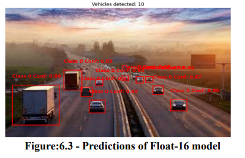
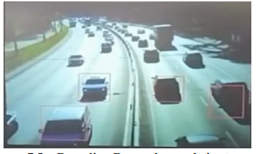

# Real-time-Traffic-Monitoring-System-using-YOLOv5-Nano
A streamlined vehicle detection framework is demonstrated here to run a lightweight model on resource constrained devices like ESP32S3 using YOLOv5 Nano model

## Vehicle Detection Framework

Vehicle detection is vital in **traffic management, planning**, and preventing **traffic congestion and fatal accidents**. This project aims to develop a **comprehensive vehicle detection framework** for deploying a **lightweight model** on **resource-constrained edge devices** like **ESP32**.

## Features

- **Lightweight Model**: Designed for low-power edge devices.
- **Efficient Detection**: Ensures accurate vehicle detection in real-time.
- **Optimized Model**: Fine-tuned YOLOv5 Nano with structured pruning and post-integer quantization.
- **Multiple Model Variants**: Best PyTorch, Pruned, Float-16, and INT8 models evaluated for performance.

## Tech Stack

- **Model**: YOLOv5 Nano
- **Optimization**: Structured pruning, post-integer quantization
- **Deployment**: ESP32 and other edge devices

## Performance Analysis

All model variants have been **thoroughly evaluated** to ensure **efficient detection and improved performance**.

## Deployment

This framework is optimized to be deployed on **ESP32** and other **low-power edge devices**, enabling **real-time vehicle detection** in resource-limited environments.

## Conclusion

This project provides a **streamlined, efficient, and edge-compatible** vehicle detection framework, leveraging **YOLOv5 Nano** to enhance **traffic monitoring and management**.

## Sample Predictions --
 
 
   **Realtime predictions** 
 

